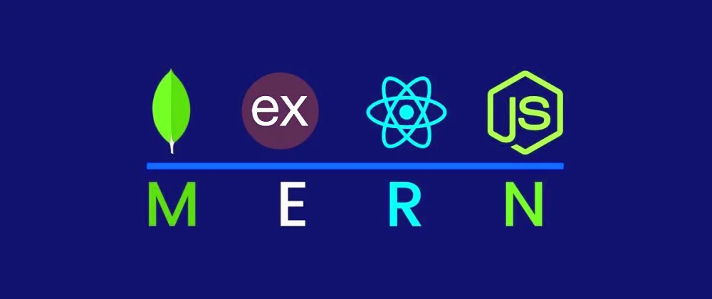

# 💫 About Me:

I'm currently working on MERN Stack I'm Lookinig to collaborate on Open source I'm Looking for help with MERN Stack I'm currently leaderng MERN Stack Ask me about MERN Stack

## 🌐 Socials:

    

# 💻 Tech Stack:

                 

# 📊 GitHub Stats:

 

---

