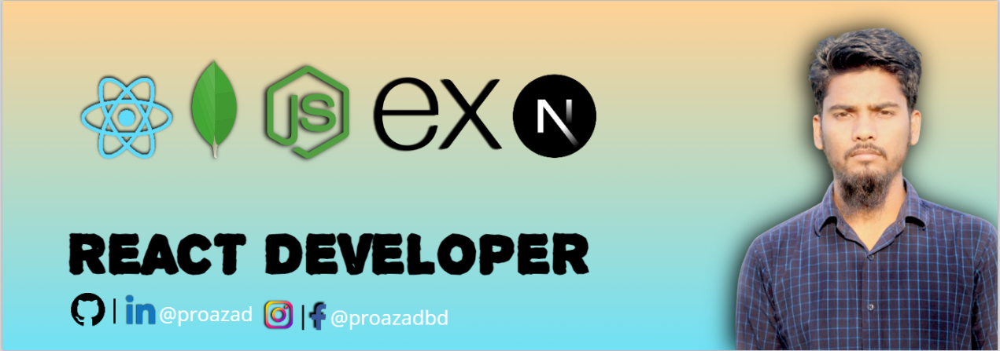

# 💫 About Me:

I'm currently working on MERN Stack I'm Lookinig to collaborate on Open source I'm Looking for help with MERN Stack I'm currently leaderng MERN Stack Ask me about MERN Stack

# BIO

Hey there! 👋 I'm Azad Hossain, a MERN Stack developer on a mission to create seamless and dynamic web experiences. My coding toolkit includes React.js and JavaScript for crafting responsive front-end solutions. You'll often find me fine-tuning interfaces with Tailwind CSS and Bootstrap CSS.

In the backend realm, I navigate through MongoDB, Node.js, and Express.js, building robust server-side components. I'm also no stranger to the power of Next.js, enhancing performance and scalability in my projects.

Always eager to learn and adapt, I stay on top of the latest trends in web development. Let's connect, collaborate, and turn ideas into reality! 💻✨ #CodeCraftsman #MERNStackMagic

## 🌐 Socials:

    

# 📊 GitHub Stats:

 

  

# My Skills

  

